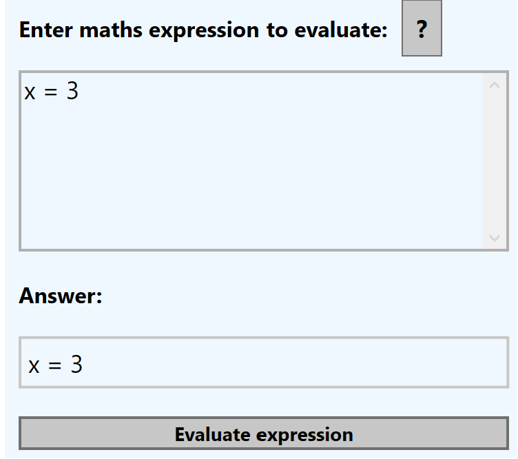
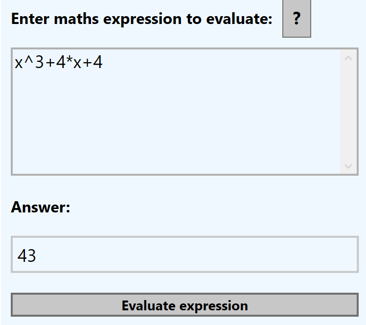
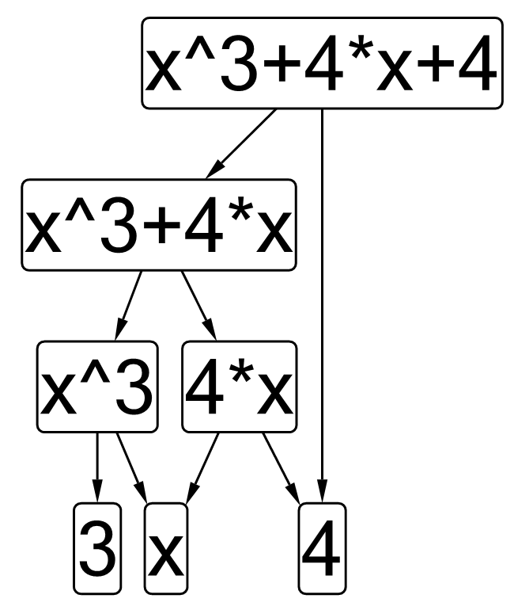

# Desktop Maths Evaluator
 A Maths Interpreter that lexes, parses and evaluates mathematical expressions and plots lines by Liam Farese, Igor stepanenko and Lyra Dalton.

# Expresion Evaluation

## Variable Assignment

Expressions can be evaluated and assigned to a variable name.

These variables and their values can be viewed in the symbol table.

    
variables can be used in place of numbers

## Abstract Syntax Tree

All expressions are lexed, parsed then evaluated in a fashion similar to a language interpreter would,
therefore, an abstract syntax tree is produced for all evaluated expressions and can be viewed under the 'visualise abstract syntax tree" option.

## Differentiation

Expressions can be differentiated, however as of current, they are not simplified.
[differentiation](images/differentiate.png)

# Line Plotting

[PlotLine](images/sinxplot.png)

## Tangent plotting

Tangents can be plotted given the value of x
[Tangents](images/tangent.png)

## Area under the curve

[AUC](images/area%20under%20curve.png)

## Programmatic Plotting

Lines can be plotted in the evaluation window given for loop syntax

[Programmatic](images/programatic%20plotting.png)

