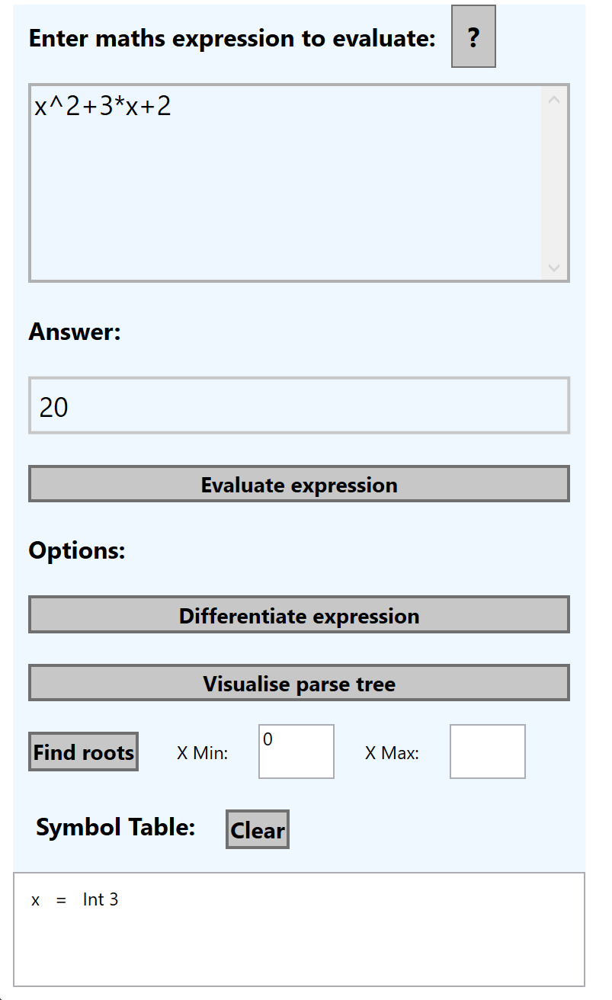
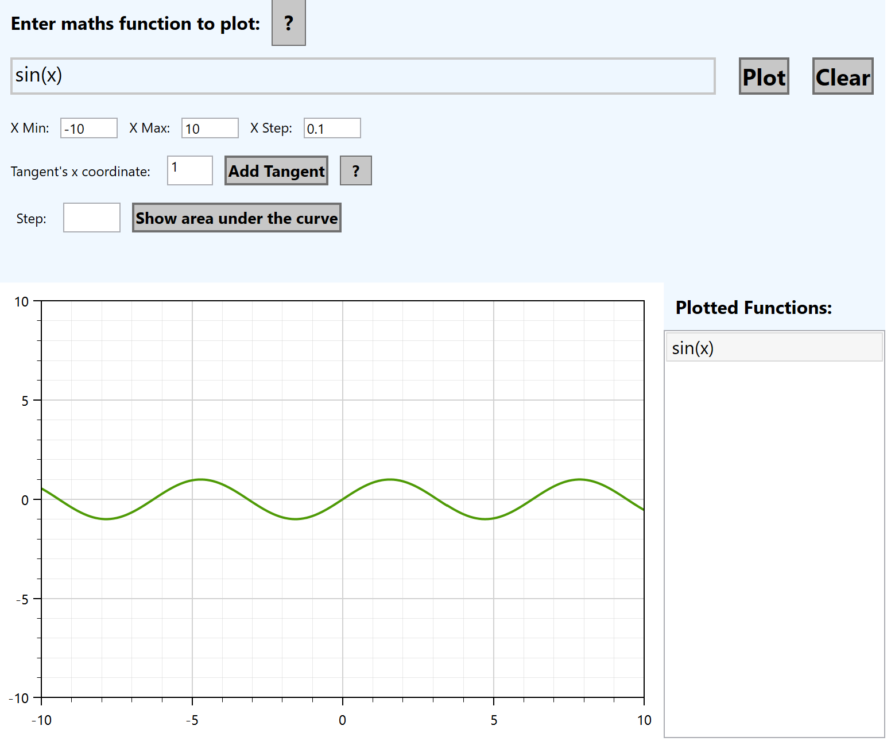
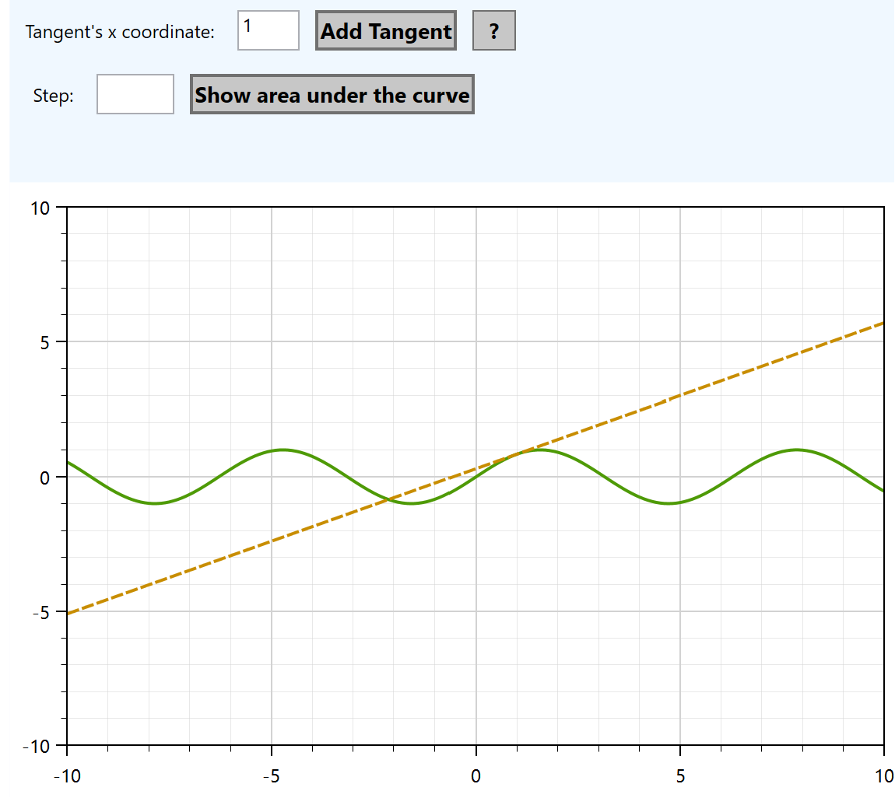

# Desktop Maths Evaluator
 A Maths Interpreter that lexes, parses and evaluates mathematical expressions and plots lines by Liam Farese, Igor stepanenko and Lyra Dalton.

# Expresion Evaluation

Expressions can be evaluated and assigned to a variable name. These variables and their values can be viewed in the symbol table. Expressions can be differentiated, however as of current, they are not simplified.

## Abstract Syntax Tree

All expressions are lexed, parsed then evaluated in a fashion similar to a language interpreter would,
therefore, an abstract syntax tree is produced for all evaluated expressions and can be viewed under the 'visualise abstract syntax tree" option.

# Line Plotting

## Tangent plotting

Tangents can be plotted given the value of x

## Area under the curve

## Programmatic Plotting

Lines can be plotted in the evaluation window given for loop syntax

